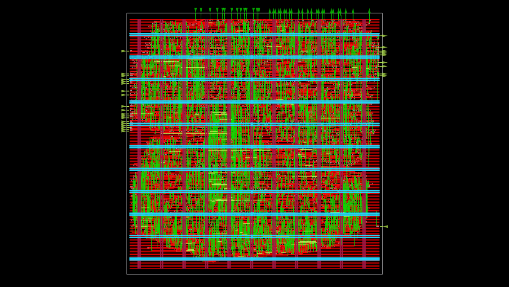

# Radix-2 DIF SDF FFT: Architecture and Results

This repository contains a streaming radix-2 decimation-in-frequency (DIF)
FFT implemented as a single-path delay-feedback (SDF) pipeline. The same
fixed-point arithmetic is represented in a Python model and in synthesizable
Verilog RTL. The implementation was taken through RTL simulation, an iCE40
FPGA flow, and a SkyWater 130 nm ASIC flow.

This document records the implementation decisions and measured results. It is
intended as engineering documentation rather than as a project landing page.

## 1. Design Summary

The checked-in configuration is an 8-point FFT processing a continuous stream
of 1024 real input samples. Each input frame contains 8 samples; the Python
reference computes one FFT per frame and the RTL emits the corresponding
stream of frequency-domain results.

| Property | Configuration |
| --- | --- |
| Algorithm | Radix-2 DIF FFT |
| Architecture | Single-path delay feedback (SDF) |
| Transform length | `N = 8` in the checked-in configuration |
| Input stream | `M = 1024` samples, or 128 frames |
| Numeric format | Signed 16-bit two's-complement fixed point |
| Fractional bits | `F = 14` (`Q2.14`) |
| Twiddle factors | `N / 2` values stored in a ROM |
| RTL language | Verilog |
| Reference model | Python with NumPy and custom fixed-point arithmetic |

The top-level RTL exposes an enable-qualified streaming interface:
`in_real`, `in_imag`, `en`, `valid_out`, `out_real`, and `out_imag`. The
pipeline accepts one enabled complex sample per cycle after reset and keeps
the feedback storage local to each SDF stage.

## 2. Architecture

An $N$-point radix-2 SDF FFT contains $\log_2(N)$ stages. Stage $s$ uses a
feedback delay of

$$D_s = \frac{N}{2^{s+1}}.$$

For the 8-point configuration, the delay lengths are 4, 2, and 1 complex
samples. A stage alternates between two modes:

1. During fill/flush, incoming samples enter the delay line while an older
     sample is forwarded.
2. During butterfly operation, the delayed sample and the current sample are
     combined. The sum branch continues forward and the difference branch is
     fed back into the delay line.

The RTL is split into small units so that the data movement and arithmetic are
visible independently:

- `sdf_stage*.v` implements the stage schedule and delay-line control.
- `circular_buffer.v` implements the feedback storage.
- `butterfly.v`, `complex_adder.v`, and `complex_subtractor.v` implement the
    butterfly arithmetic.
- `twiddle_rom.v` supplies the stage-specific coefficients.
- `top_level.v` cascades the stages and propagates the valid signal.

The final stages have dedicated `d4`, `d2`, and `d1` implementations. This
keeps the short delay cases explicit and allows the top-level generate block to
cover larger transform sizes without changing the external interface.

### Multiplier pipeline

The complex multiplier is placed after the butterfly commutator rather than
inside the feedback recurrence. Its five registered steps are:

1. Register operands.
2. Compute high/high, high/low, low/high, and low/low partial products.
3. Add the cross terms.
4. Recombine the partial products into full-width real products.
5. Form the complex result, round, shift, and register the output.

The valid/enable path is delayed with the arithmetic pipeline. This preserves
sample alignment while keeping the feedback loop independent of the
multiplier's internal latency. Splitting the multiplier in this way was also
the main FPGA timing optimization: it removes a multiply-plus-add chain from
one combinational stage and distributes the work across registers.

## 3. Fixed-Point Behavior

The datapath uses signed 16-bit `Q2.14` values. A product is formed at the
full intermediate width, rounded by adding $2^{F-1}$, and then shifted back to
the working format. Each radix-2 butterfly stage scales its result by two.
Across the three stages of the 8-point transform, the hardware output is
therefore attenuated by $1/N$; the verification code restores the magnitude by
multiplying by `N` before comparing it with NumPy's FFT.

The Python model mirrors this behavior in `python_model/model/` and uses the
same twiddle factors, input encoding, frame boundaries, bit-reversal mapping,
and output scaling. This makes it a numerical reference for the RTL rather
than only a floating-point algorithm model.

## 4. Verification Method

`python_model/scripts/gen_test_vectors.py` generates:

- four complex twiddle factors for the 8-point transform;
- 1024 fixed-point input samples from a two-tone signal plus offset and noise;
- 1024 floating-point golden FFT outputs, computed independently per frame.

`python_model/scripts/run_simulation.py` executes the fixed-point model,
reorders the DIF output with local frame bit reversal, restores the FFT scale,
and computes

$$
\mathrm{SQNR} = 10\log_{10}\left(
\frac{\sum_n |y_{golden}[n]|^2}
{\sum_n |y_{golden}[n]-y_{fixed}[n]|^2}
\right).
$$

The Verilator testbench in `tb/tb_fft_top.v` performs the equivalent check on
the RTL. It injects all 1024 samples, flushes the pipeline with zeros, aligns
the streamed output to the golden frame using bit reversal, and accumulates
the error power over all valid results.

### Current verification result

Running the checked-in Python flow produced:

```text
SQNR = 73.06 dB
Simulation Complete.
```

The checked-in golden file contains 1024 complex results. The result is
consistent with the expected quantization floor for a 16-bit, Q2.14,
stage-scaled FFT. The result is stimulus-dependent; changing the generated
noise or fixed-point parameters changes the reported SQNR.

Run the Python reference flow from `python_model/`:

```bash
python3 scripts/gen_test_vectors.py
python3 scripts/run_simulation.py
```

Run the Verilator RTL testbench from the repository root:

```bash
make run
```

The RTL Makefile compiles all files under `rtl/`, runs `tb/tb_fft_top.v`, and
writes generated simulation output under `sim/`. Those outputs are ignored by
Git.

## 5. Implementation Results

### ASIC: 8-point FFT on SkyWater 130 nm

The ASIC configuration targets the SkyWater `sky130A` PDK and the
`sky130_fd_sc_hd` standard-cell library through OpenLane 2. The tracked
`asic/metrics.csv` records the following final-flow values:

| Metric | Result |
| --- | ---: |
| Clock Speed at worst corner | 94.71 MHz |
| Core bounding-box area | 196,808 $\mu m^2$ (0.1968 $mm^2$) |
| Standard-cell utilization | 38.9065% |
| Standard-cell instances | 13,039 |
| Macros | 0 |
| Target clock period | 13.0 ns |
| Aggregate setup slack | +1.4416 ns |
| Aggregate hold slack | +0.1046 ns |
| Setup TNS / violating paths | 0 / 0 |
| Hold TNS / violating paths | 0 / 0 |
| Flow errors | 0 |
| Power-grid violations | 0 |
| Estimated routed wire length | 179,254 $\mu m$ |

- Timing Closure achieved across all corners; worst-case corner `max_ss_100C_1v60` runs at 94.71 MHz.
- The nominal corner `nom_tt_025C_1v80` runs at 182.59 MHz.

Timing and routing work focused on high-fanout and slew behavior. The tracked
`asic/trace_violators.tcl` script traces violating physical instances back to
their sequential or top-level RTL drivers, which supports targeted RTL
register cloning and load balancing instead of blind global changes. The ASIC
configuration also enables post-placement and post-routing timing repair,
antenna repair, clock-tree synthesis, and KLayout DRC checks.  

**Resulting GDS**



### FPGA: Lattice iCE40-HX8K

The FPGA flow uses Yosys, nextpnr-ice40, and icetime for the HX8K in the CT256
package. The recorded 8-point implementation result is:
#### 8-point FFT
| Metric | Result |
| --- | ---: |
| Logic cells | 1,375 / 7,680 (17%) |
| Timing estimate | 10.29 ns |
| Estimated frequency | 97.18 MHz |

- The multiplier pipeline restructuring improved the 8-point result from the
earlier 51 MHz / 32% implementation to approximately 97 MHz / 17%.

#### 512-point FFT
| Metric | Result |
| --- | ---: |
| Logic cells | 7,032 / 7,680 (91%) |
| Timing estimate | 12.08 ns |
| Estimated frequency | 82.79 MHz |


#### How to run:
- If needed, you can simply change the N parameter to your power-of-two of choice in `top_level.v`, then:
```bash
cd fpga
make all
```

## 6. Directory Structure

Only the relevant tracked source and result directories are listed here.

```text
.
├── rtl/                  Synthesizable FFT RTL and fixed-point parameters
├── tb/                   Verilator streaming testbench and SQNR monitor
├── python_model/         Bit-accurate model, vector generation, and analysis
├── data/
│   ├── stimulus/         Checked-in input and twiddle-factor hex files
│   └── golden/           Checked-in floating-point reference output
├── asic/                 OpenLane 2 configuration, metrics, and debug Tcl
├── fpga/                 iCE40 source constraints, Makefile flow, and bitstreams
└── README.md             This results and implementation record
```

The following are intentionally omitted from this documentation's source
inventory because they are ignored or generated: `sim/`, `fpga/build/`,
`dump/`, virtual environments, Python bytecode, and local editor metadata.

## 7. Reproducibility Notes

- Run commands from the directories shown above; the RTL include paths and
    the Python data paths are relative to those working directories.
- The checked-in stimulus is deterministic once generated data is retained,
    but `gen_test_vectors.py` adds random noise when regenerating it. For an
    apples-to-apples comparison, preserve the checked-in files or seed the
    generator before creating a new result.
- The ASIC flow requires an OpenLane 2 installation and the SkyWater 130 nm
    PDK. The FPGA flow requires the iCE40 toolchain. Neither toolchain is part
    of this repository.